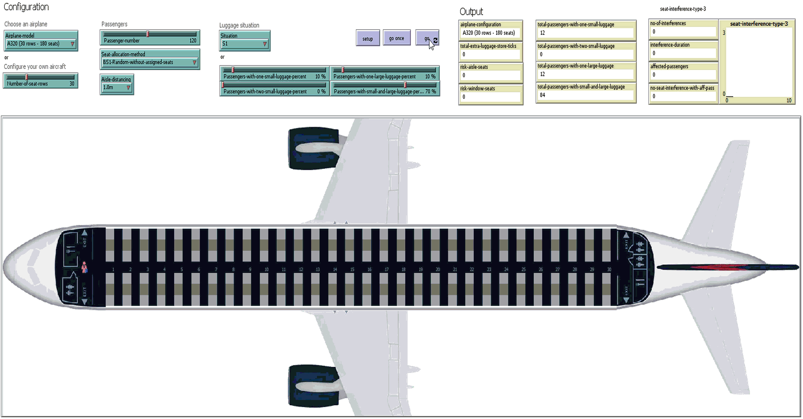
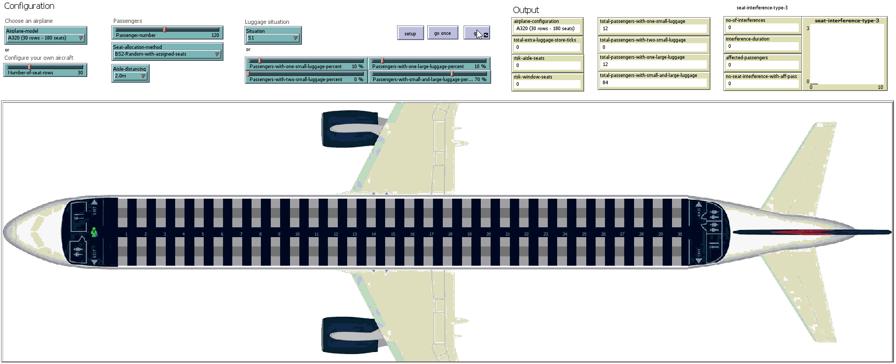
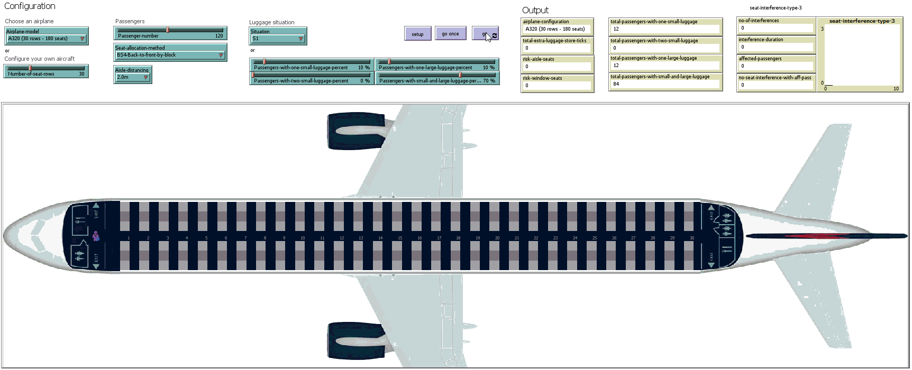
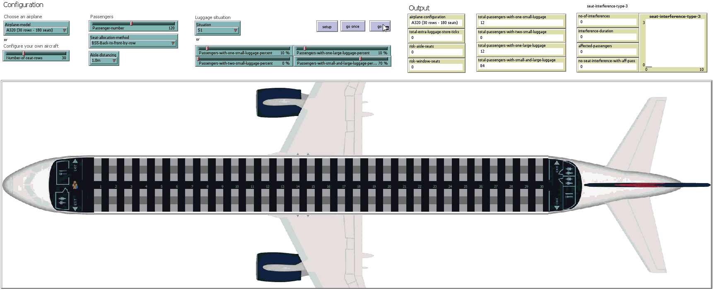
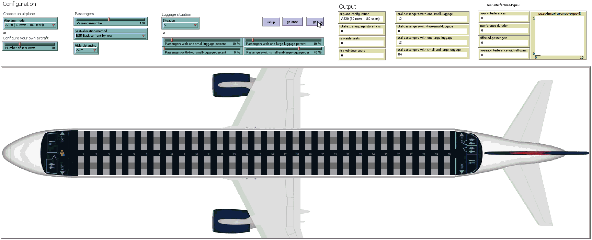

Recordings of the simulations presented in 
### **"Evaluating Classical Airplane Boarding Methods Considering COVID-19 Flying Restrictions"** 
submitted to the `Symmetry` journal. 

Please feel free to contact us at liviu.cotfas at ase .ro for further details. 

## Boarding Scenarios

All the simulations have been performed using the following settings:
- occupancy level: 100% (120 passengers);
- luggage situation: S1 (described in our paper).

> Suggestions: 
> 1. You can download the animations below in order to watch them at a higher resolution.
> 2. Click on the animations to view the associated video on YouTube.

### BS1-Random-without-assigned-seats
#### Aisle distancing: 1.0m

#### Aisle distancing: 2.0m

### BS2-Random-with-assigned-seats
#### Aisle distancing: 1.0m

#### Aisle distancing: 2.0m

### BS3-Outside-in (WILMA)
#### Aisle distancing: 1.0m

#### Aisle distancing: 2.0m

### BS4-Back-to-front-by-block
#### Aisle distancing: 1.0m

#### Aisle distancing: 2.0m

### BS5-Back-to-front-by-row
#### Aisle distancing: 1.0m

#### Aisle distancing: 2.0m

### BS6-Modified-reverse-pyramid-half-zone
#### Aisle distancing: 1.0m

#### Aisle distancing: 2.0m
